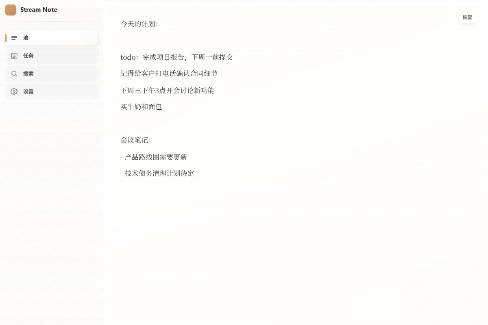
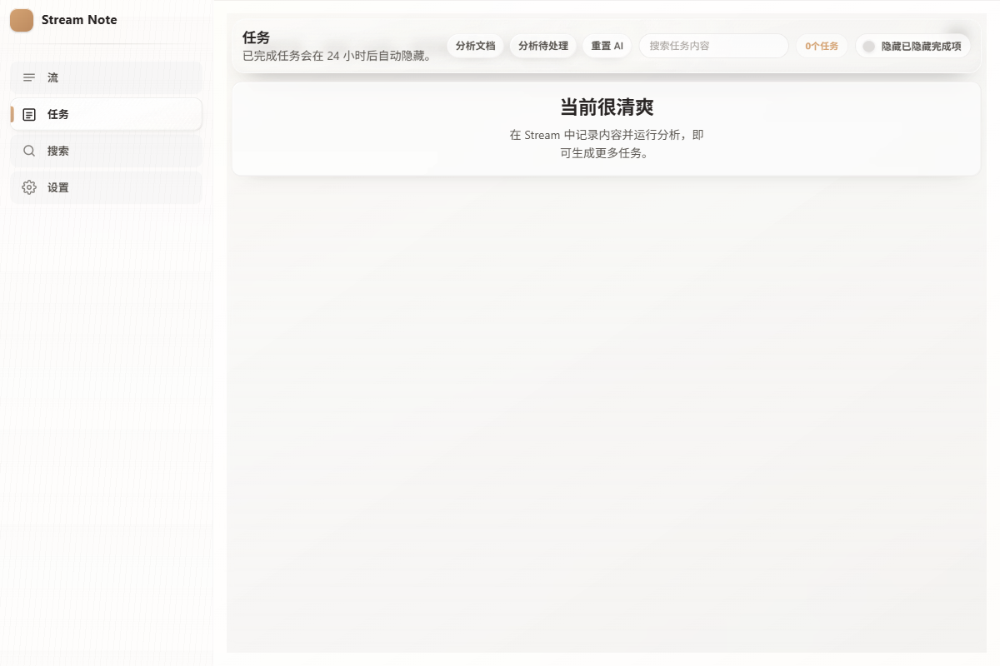
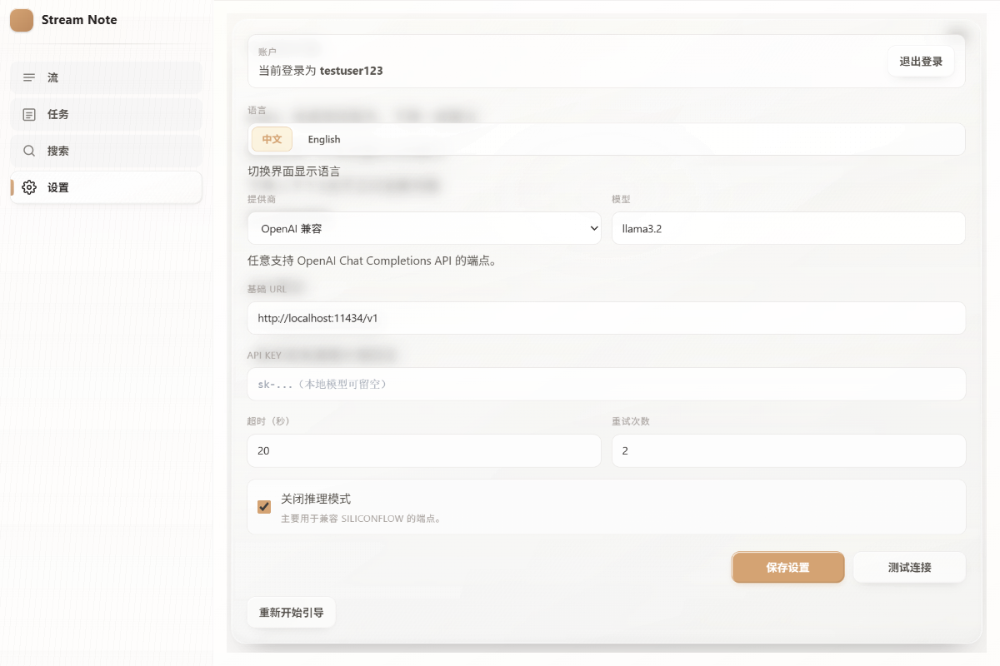
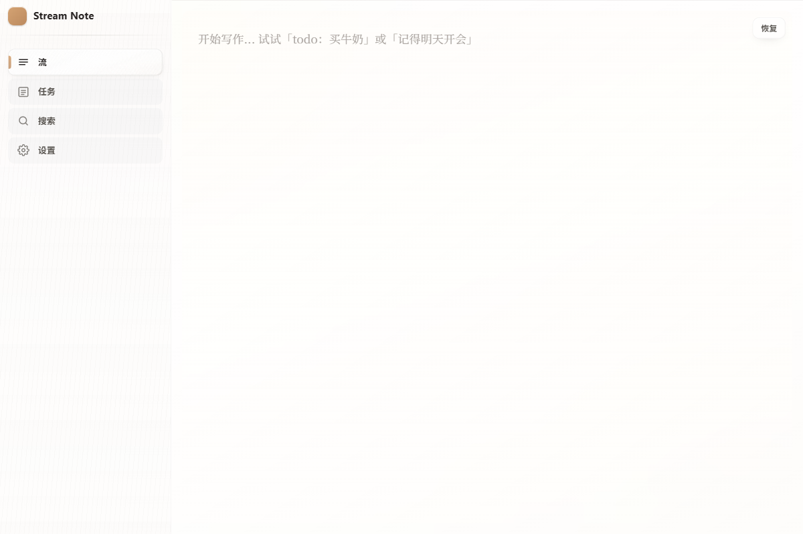

# Stream Note

<div align="center">

**A minimalist, privacy-first note-taking app with AI-powered task recognition**

[](https://www.gnu.org/licenses/agpl-3.0)
[](https://vuejs.org/)
[](https://fastapi.tiangolo.com/)
[](https://www.python.org/)

[Features](#features) • [Quick Start](#quick-start) • [Screenshots](#screenshots) • [Documentation](#documentation) • [Contributing](#contributing)

</div>

---

## Overview

Stream Note is an open-source note-taking application that combines a clean, distraction-free writing experience with intelligent AI assistance. Write freely, and let tasks emerge naturally from your notes.

### Key Highlights

- 📝 **Stream Editor** - Clean, TipTap-powered writing experience
- 🤖 **Silent AI Analysis** - Tasks are automatically recognized from your notes
- 🔒 **Offline-First** - Your data stays on your device by default
- 📱 **Cross-Platform** - Web, Android, and iOS support
- 🌐 **Self-Hostable** - Deploy your own instance with full control
- 🌍 **i18n Ready** - Supports Chinese and English

---

## Features

### Stream Editor
- Distraction-free writing with TipTap
- Auto-save with local-first storage (localforage)
- Document version history and recovery

### AI-Powered Task Recognition
- Automatic task extraction from natural language
- Chinese time expression parsing (e.g., "下周一", "后天")
- Silent background analysis - no manual trigger needed

### Task Management
- Clean task list view with status tracking
- Completed tasks auto-hide after 24 hours
- Task completion synced across documents

### Privacy & Control
- Local-first architecture
- Optional self-hosting
- Works offline

---

## Screenshots

<table>
  <tr>
    <td align="center"><b>Stream Editor</b></td>
    <td align="center"><b>Task View</b></td>
  </tr>
  <tr>
    <td>
      
    </td>
    <td>
      
    </td>
  </tr>
  <tr>
    <td align="center"><b>Settings</b></td>
    <td align="center"><b>Clean UI</b></td>
  </tr>
  <tr>
    <td>
      
    </td>
    <td>
      
    </td>
  </tr>
</table>

---

## Tech Stack

| Layer | Technology |
|-------|------------|
| **Frontend** | Vue 3, TypeScript, Pinia, TipTap, TailwindCSS |
| **Backend** | FastAPI, SQLAlchemy, Alembic |
| **AI** | OpenAI-compatible API (supports OpenAI, Ollama, SiliconFlow) |
| **Storage** | SQLite (localforage for frontend cache) |
| **Mobile** | Capacitor (Android/iOS) |

---

## Project Structure

```
stream_note/
├── stream-note-web/          # Vue 3 frontend
│   ├── src/
│   │   ├── components/       # Vue components
│   │   ├── views/            # Page views
│   │   ├── stores/           # Pinia stores
│   │   ├── services/         # API client
│   │   ├── composables/      # Vue composables
│   │   ├── types/            # TypeScript types
│   │   └── assets/           # Styles & static assets
│   └── package.json
├── stream-note-api/          # FastAPI backend
│   ├── app/
│   │   ├── api/              # API endpoints
│   │   ├── models/           # SQLAlchemy models
│   │   ├── services/         # Business logic
│   │   └── core/             # Config & utilities
│   ├── alembic/              # Database migrations
│   └── scripts/              # Utility scripts
├── docs/                     # Developer documentation
│   ├── frontend-code-knowledge.md
│   └── backend-code-knowledge.md
└── README.md
```

---

## Quick Start

### Prerequisites

- Node.js 18+
- Python 3.11+
- uv (Python package manager)

### Frontend

```bash
cd stream-note-web
npm install
cp .env.example .env
npm run dev
```

Access at http://localhost:5173

### Backend

```bash
cd stream-note-api
uv venv .venv
uv sync --python .venv/Scripts/python.exe
cp .env.example .env
uv run --python .venv/Scripts/python.exe python scripts/migrate_db.py
uv run --python .venv/Scripts/python.exe python -m uvicorn app.main:app --reload
```

API available at http://localhost:8000

### Windows One-Click Start

From project root (starts both frontend and backend):

```powershell
.\start-dev.bat
```

Options:

```powershell
# Skip dependency installation
.\start-dev.bat -NoInstall

# Custom ports
.\start-dev.bat -BackendPort 8001 -FrontendPort 5174
```

---

## Mobile Packaging

Stream Note supports Android and iOS via Capacitor.

### Setup

```bash
cd stream-note-web
npm install
npm run cap:add:android
npm run cap:add:ios
```

### Build & Sync

```bash
# Build web assets and sync to native projects
npm run build:mobile

# Open in Android Studio / Xcode
npm run open:android
npm run open:ios
```

### Configuration

Set your API endpoint in `stream-note-web/.env`:

```bash
VITE_API_BASE_URL=http://your-server:8000/api/v1
```

---

## Configuration

### Backend Environment Variables

Edit `stream-note-api/.env`:

| Variable | Description | Default |
|----------|-------------|---------|
| `DATABASE_URL` | Database connection string | `sqlite:///./stream_note.db` |
| `SQLITE_TIMEOUT_SECONDS` | SQLite lock wait timeout | `30` |
| `OPENAI_PROVIDER` | AI provider type | `openai_compatible` |
| `OPENAI_API_BASE` | API endpoint | `http://localhost:11434/v1` |
| `OPENAI_API_KEY` | API key | - |
| `OPENAI_MODEL` | Model name | `llama3.2` |
| `OPENAI_TIMEOUT_SECONDS` | Request timeout | `20` |
| `OPENAI_MAX_ATTEMPTS` | Retry attempts | `2` |

### Supported AI Providers

- `openai_compatible` - Any OpenAI-compatible endpoint
- `openai` - Official OpenAI API
- `siliconflow` - SiliconFlow
- `ollama` - Local Ollama server

### Database Maintenance

```bash
# Run schema migrations (with auto-backup)
uv run --python .venv/Scripts/python.exe python scripts/migrate_db.py

# Create manual backup
uv run --python .venv/Scripts/python.exe python scripts/backup_db.py

# Restore from backup
uv run --python .venv/Scripts/python.exe python scripts/restore_db.py --backup-file <path>
```

---

## Deployment

### Build & Deploy Script

Root script: `build-deploy.ps1`

Features:
- Build frontend and deploy to web root
- Build Android release packages (`.apk` + `.aab`)
- Build iOS `.ipa` on macOS
- Start backend/frontend servers

```powershell
# Run deployment
powershell -ExecutionPolicy Bypass -File .\build-deploy.ps1

# Dry-run (print commands only)
powershell -ExecutionPolicy Bypass -File .\build-deploy.ps1 -DryRun
```

Key configuration (at top of script):
- `BackendPublicHost` / `BackendPublicPort` - Public API endpoint
- `FrontendBindHost` / `FrontendPort` - Frontend server address
- `FrontendDeployDir` - Static files directory
- `BackendDeployDir` - Backend runtime directory

---

## Documentation

- **Frontend Architecture**: `docs/frontend-code-knowledge.md`
- **Backend Architecture**: `docs/backend-code-knowledge.md`
- **Product Spec**: `STREAM_NOTE_PLANNING.md`
- **Design System**: `STREAM_NOTE_STYLE_GUIDE.md`

---

## Contributing

Contributions are welcome! Please feel free to submit a Pull Request.

### Development Setup

1. Fork the repository
2. Create your feature branch (`git checkout -b feature/amazing-feature`)
3. Make your changes
4. Run tests (if applicable)
5. Commit your changes (`git commit -m 'Add amazing feature'`)
6. Push to the branch (`git push origin feature/amazing-feature`)
7. Open a Pull Request

### Code Style

- Frontend: Follow Vue 3 + TypeScript best practices
- Backend: Follow PEP 8 and use type hints

---

## License

This project is licensed under the GNU Affero General Public License v3.0 (AGPL-3.0) - see the [LICENSE](LICENSE) file for details.

### What this means

- ✅ You can use, study, and modify the software
- ✅ You can distribute the software
- ✅ You can host it as a service
- ⚠️ If you modify and provide it as a network service, you must make your modifications available under the same license

---

## Acknowledgments

- [TipTap](https://tiptap.dev/) - Rich text editor
- [FastAPI](https://fastapi.tiangolo.com/) - Modern Python web framework
- [Vue.js](https://vuejs.org/) - Progressive JavaScript framework
- [Capacitor](https://capacitorjs.com/) - Cross-platform native runtime

---

<div align="center">

**[⬆ back to top](#stream-note)**

</div>
